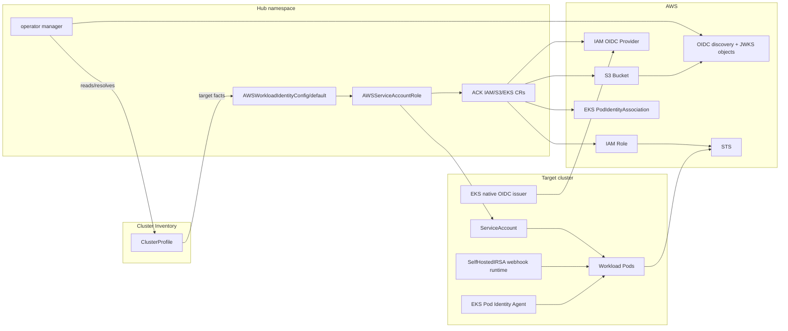

# aws-workload-identity-operator

`aws-workload-identity-operator` binds Kubernetes `ServiceAccount` identities to
AWS IAM roles across a fleet of clusters.

The operator runs on a hub cluster. It discovers target clusters through the
Cluster Inventory API, writes remote Kubernetes resources through
multicluster-runtime, and treats ACK custom resources as the source of truth for
AWS IAM, S3 bucket, and EKS resources.

## Delivery Types

The public workload API is the same for all delivery mechanisms:

- `SelfHostedIRSA`: for self-hosted Kubernetes clusters that use AWS web identity
  federation through a platform-managed OIDC issuer.
- `EKSIRSA`: for managed EKS clusters that use the native EKS OIDC issuer and
  IAM Roles for Service Accounts.
- `EKSPodIdentity`: for managed EKS clusters that use EKS Pod Identity
  associations.

See [delivery types](docs/concepts/delivery-types.md) for the decision model and
required cluster facts.

## Design

The operator owns four API types in `aws.identity.appthrust.io/v1alpha1`:

- `AWSWorkloadIdentityOperatorConfig`: cluster-scoped platform defaults.
- `AWSWorkloadIdentityConfig`: namespace-scoped target-cluster identity
  configuration.
- `AWSServiceAccountRole`: namespace-scoped binding from one remote Kubernetes
  `ServiceAccount` to one generated IAM role.
- `AWSServiceAccountRoleReplicaSet`: namespace-scoped fleet binding that creates
  one `AWSServiceAccountRole` child per selected cluster namespace.

The hub namespace is the target-cluster boundary. ACK CRs are created in that
hub namespace, and ACK reconciles those CRs into AWS resources.

See [architecture](docs/concepts/architecture.md) and
[resource ownership](docs/concepts/resource-ownership.md) for the full model.

## Prerequisites

- Kubernetes 1.35 or newer.
- Cluster Inventory API and `ClusterProfile` objects for target clusters.
- For OCM, `ClusterProfile` access through the OCM access provider, backed by a
  normal `ManagedClusterSetBinding` in the operator namespace.
- ACK controllers for the selected delivery type: IAM and S3 for
  `SelfHostedIRSA`; IAM for `EKSIRSA`; IAM and EKS for `EKSPodIdentity`.
- AWS credentials for ACK controllers, plus S3 object write/delete permissions
  for the manager when using `SelfHostedIRSA`.
- cert-manager for the chart-managed validating webhook TLS.

See [compatibility and prerequisites](docs/reference/compatibility.md),
[install with Helm](docs/guides/install-helm.md),
[Cluster Inventory and OCM](docs/concepts/cluster-inventory-and-ocm.md), and
[IAM permissions](docs/reference/iam-permissions.md).

## Install

Install the operator with the published Helm chart or a local chart checkout.
The command and chart setup details live in
[Install With Helm](docs/guides/install-helm.md); full chart
behavior and values live in the
[chart README](charts/aws-workload-identity-operator/README.md).

## Configure Platform Defaults

Create `AWSWorkloadIdentityOperatorConfig/default` before creating workload
bindings. See [configure platform defaults](docs/guides/configure-platform-defaults.md).

## Self-Hosted IRSA

For self-hosted clusters, use `AWSWorkloadIdentityConfig/default` with
`spec.type: SelfHostedIRSA`, then create `AWSServiceAccountRole` bindings for
remote service accounts. See
[bind a service account](docs/guides/bind-service-account.md) and
[SelfHostedIRSA behavior](docs/reference/operator-behavior.md#self-hosted-irsa-behavior).

### Hub-Side Remote IRSA Consumers

Hub-side consumers are an advanced integration path for controllers or tools
that need AWS credentials for a remote `ServiceAccount` without running a Pod on
the target cluster. They are not part of the normal workload binding flow.

See [hub-side remote IRSA consumers](docs/guides/remote-irsa-consumers.md).

### Manager IAM Policy

For `SelfHostedIRSA`, the manager verifies, writes, and deletes only the OIDC
discovery and JWKS S3 objects directly with the AWS S3 API. See
[IAM permissions](docs/reference/iam-permissions.md#selfhostedirsa-manager-policy).

## EKS IRSA

For EKS clusters that use native IAM Roles for Service Accounts, use the same
binding API with `spec.type: EKSIRSA` and set `spec.eksIRSA.issuerURL` to the EKS
OIDC issuer URL. `EKSIRSA` can manage the IAM OIDC provider through ACK IAM or
reference an external provider ARN. It creates no self-hosted S3 issuer and no
self-hosted webhook runtime. See
[delivery types](docs/concepts/delivery-types.md#eksirsa) and
[EKSIRSA behavior](docs/reference/operator-behavior.md#eksirsa-behavior).

## EKS Pod Identity

For EKS clusters that use EKS Pod Identity, use the same binding API with
`spec.type: EKSPodIdentity`.
`EKSPodIdentity` creates no self-hosted OIDC issuer. See
[delivery types](docs/concepts/delivery-types.md#eks-pod-identity) and
[EKS Pod Identity behavior](docs/reference/operator-behavior.md#eks-pod-identity-behavior).

## Fleet Bindings

Use `AWSServiceAccountRoleReplicaSet` when an OCM `Placement` should fan out the
same binding to many selected cluster namespaces. See
[fleet bindings](docs/guides/fleet-bindings.md).

## Restrict IAM Policy Inputs

The operator validates the `AWSServiceAccountRole` API shape and generates IAM
roles and trust policies, but platform-specific IAM allowlists belong in an
admission policy engine. See
[restrict IAM policy inputs](docs/guides/restrict-iam-policy-inputs.md).

## Observability

The manager metrics endpoint is always enabled. The Helm chart can render a
Prometheus Operator `ServiceMonitor`, and logging is configured with
OpenTelemetry-oriented values. See [observability](docs/operations/observability.md)
and [metrics](docs/reference/metrics.md).

## Documentation

Start with the [documentation index](docs/README.md):

- New users: [quickstart](docs/quickstart.md).
- Platform operators: [install](docs/guides/install-helm.md), [configure
  defaults](docs/guides/configure-platform-defaults.md), and
  [bind service accounts](docs/guides/bind-service-account.md).
- Example manifests: [examples](docs/examples/README.md).
- Integrators: [hub-side remote IRSA consumers](docs/guides/remote-irsa-consumers.md).
- Operators debugging behavior: [operator behavior](docs/reference/operator-behavior.md),
  [status conditions](docs/reference/status-conditions.md), and
  [cleanup](docs/operations/cleanup-and-force-delete.md).

## Contributing

Development, testing, image build, and CI details are in
[CONTRIBUTING.md](CONTRIBUTING.md).
