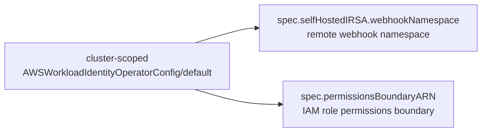
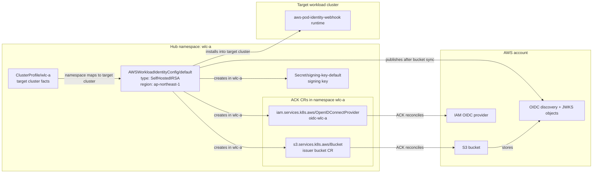
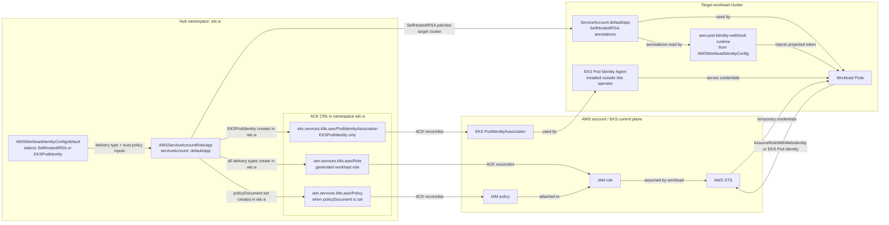

# aws-workload-identity-operator

`aws-workload-identity-operator` binds Kubernetes workloads to AWS IAM roles
across a fleet of clusters.

It provides one workload-facing API for two delivery mechanisms:

- `SelfHostedIRSA` for self-hosted Kubernetes clusters that use AWS web identity
  federation through a platform-managed OIDC issuer.
- `EKSPodIdentity` for managed EKS clusters that use EKS Pod Identity
  associations.

The operator runs on a hub cluster. It discovers target clusters through
Cluster Inventory API `ClusterProfile` objects, writes remote runtime resources
through multicluster-runtime, and uses ACK CRs as the authoritative writer for
AWS control-plane resources such as IAM roles, IAM OIDC providers, S3 buckets,
and EKS Pod Identity associations. Self-hosted OIDC discovery and JWKS objects
are published into the ACK-managed S3 bucket as S3 objects.

## Design

The diagrams below are intentionally resource models, not controller topology.
Here `wlc-a` is an example hub namespace; in this project, that namespace is
the target-cluster boundary. ACK custom resources are created in that hub
namespace, then ACK reconciles those CRs into AWS resources.

`AWSWorkloadIdentityOperatorConfig/default` provides cluster-wide defaults used
by the other resources:



`AWSWorkloadIdentityConfig/default` configures one hub namespace that maps to
one target cluster. For `SelfHostedIRSA`, it creates the issuer and installs the
remote webhook runtime:



`AWSServiceAccountRole` binds one remote Kubernetes `ServiceAccount` to AWS
permissions. It always creates an IAM Role ACK CR in the hub namespace; optional
policy and delivery resources depend on the spec and delivery type:



The operator owns three API types in `aws.identity.appthrust.io/v1alpha1`:

- `AWSWorkloadIdentityOperatorConfig`: cluster-scoped platform configuration,
  optional permissions boundary, and self-hosted IRSA webhook namespace.
- `AWSWorkloadIdentityConfig`: namespace-scoped target-cluster identity
  configuration. The namespace maps to a target `ClusterProfile`.
- `AWSServiceAccountRole`: namespace-scoped binding from one remote Kubernetes
  `ServiceAccount` to one generated IAM role.

More documentation lives under [docs](docs/README.md), including the
[operator behavior reference](docs/operator-behavior.md) for readiness
conditions, delivery-specific details, controller ownership, and idempotency.

## Prerequisites

- Kubernetes 1.35 or newer. The Helm chart uses Kubernetes image volumes for
  Cluster Inventory access-provider plugins.
- Cluster Inventory API and OCM-generated `ClusterProfile` objects. For OCM,
  enable `ClusterProfile` on the hub, bind the managed cluster set into the
  operator namespace, and enable the `cluster-proxy` ClusterProfile access
  provider (`featureGates.clusterProfileAccessProvider=true`,
  `enableServiceProxy=true`, `userServer.enabled=true`).
- For OCM access, OCM `managed-serviceaccount` with
  `featureGates.clusterProfileCredSyncer=true`, plus a per-managed-cluster
  `ManagedServiceAccount` whose name matches the configured
  `--managed-serviceaccount=<name>` Cluster Inventory provider arg and is
  labelled
  `authentication.open-cluster-management.io/sync-to-clusterprofile=true`.
  The Helm chart can create these OCM resources when
  `ocm.managedServiceAccount.create=true`.
- ACK controllers for the AWS APIs used by the selected delivery mechanism:
  IAM and S3 for `SelfHostedIRSA`; IAM and EKS for `EKSPodIdentity`.
- AWS credentials for the ACK controllers and for the operator manager. For
  `SelfHostedIRSA`, the manager writes and deletes the two public OIDC issuer
  objects in S3; see [Manager IAM Policy](#manager-iam-policy).
- cert-manager for the Helm chart's validating webhook TLS.

When the manager must call an AWS-compatible endpoint instead of the default
AWS endpoint resolution, configure the chart with `aws.endpointURL`. HTTP
endpoints also require `aws.allowUnsafeEndpointURLs=true`. This mirrors ACK's
AWS API endpoint override; it does not change the public
`SelfHostedIRSA` issuer URL, which remains the regional S3 HTTPS URL for the
generated bucket.

## Install

Install the released Helm chart from GHCR's OCI registry. Replace `0.1.0`
with the release version you want to run:

```sh
helm upgrade --install aws-workload-identity-operator \
  oci://ghcr.io/appthrust/helm-charts/aws-workload-identity-operator \
  --version 0.1.0 \
  --namespace aws-workload-identity-operator-system \
  --create-namespace
```

Use `./charts/aws-workload-identity-operator` only when installing unreleased
local changes from a source checkout.

The chart installs CRDs, RBAC, the manager Deployment, webhook configuration,
and the Cluster Inventory access-provider file by default.

The chart generates the OCM `cp-creds` Cluster Inventory access provider
and merges it with any additional `clusterInventory.accessProviders`.
The generated OCM provider uses
`ocm.managedServiceAccount.name` for the managed service account argument and
is mounted as an image volume:

```yaml
clusterInventory:
  accessProviders: []
  plugins:
    - name: open-cluster-management
      # Do not pin cp-creds by SHA yet; upstream digests change frequently while it stabilizes.
      image: quay.io/open-cluster-management/cp-creds:latest
      mountPath: /plugins
ocm:
  managedServiceAccount:
    name: aws-workload-identity-operator
```

When enabling chart-created OCM `ManagedServiceAccount` resources, the
generated OCM provider automatically uses the same name:

```yaml
ocm:
  managedServiceAccount:
    name: custom-awio
    create: true
    namespaces:
      - wlc-a
```

## Configure Platform Defaults

Create the platform configuration before creating workload bindings:

```yaml
apiVersion: aws.identity.appthrust.io/v1alpha1
kind: AWSWorkloadIdentityOperatorConfig
metadata:
  name: default
spec:
  selfHostedIRSA:
    webhookNamespace: aws-pod-identity-webhook
```

For `SelfHostedIRSA`, `spec.selfHostedIRSA.webhookNamespace` in this
`AWSWorkloadIdentityOperatorConfig/default` object is the source of truth for
the remote webhook namespace.

`permissionsBoundaryARN` is optional. AWS supports IAM roles without a
permissions boundary, and the operator sets one only when the platform
configuration includes this value.

To set one:

```yaml
apiVersion: aws.identity.appthrust.io/v1alpha1
kind: AWSWorkloadIdentityOperatorConfig
metadata:
  name: default
spec:
  permissionsBoundaryARN: arn:aws:iam::123456789012:policy/appthrust-workload-identity-boundary
  selfHostedIRSA:
    webhookNamespace: aws-pod-identity-webhook
```

## Self-Hosted IRSA

The workload namespace is the target-cluster boundary. With OCM-generated
ClusterProfiles, the `ClusterProfile` lives in the operator namespace and is
resolved by the `open-cluster-management.io/cluster-name` label. A normal
`ManagedClusterSetBinding` in the operator namespace is enough for OCM access.
For example, this `ClusterProfile` describes target cluster `wlc-a`:

```yaml
apiVersion: multicluster.x-k8s.io/v1alpha1
kind: ClusterProfile
metadata:
  name: wlc-a
  namespace: aws-workload-identity-operator-system
  labels:
    open-cluster-management.io/cluster-name: wlc-a
    x-k8s.io/cluster-manager: open-cluster-management
spec:
  displayName: wlc-a
  clusterManager:
    name: open-cluster-management
status:
  conditions:
    - type: ControlPlaneHealthy
      status: "True"
      observedGeneration: 1
      lastTransitionTime: "2026-04-30T00:00:00Z"
      reason: Healthy
      message: target cluster API server is reachable
  version:
    kubernetes: v1.35.0
  properties: []
  accessProviders:
    - name: open-cluster-management
      cluster:
        server: https://wlc-a-api.example.com:6443
        certificate-authority-data: LS0tLS1CRUdJTiBDRVJUSUZJQ0FURS0tLS0tCg==
```

Create one `AWSWorkloadIdentityConfig/default` in the matching workload
namespace. For OCM, this namespace matches the
`open-cluster-management.io/cluster-name` label value:

```yaml
apiVersion: aws.identity.appthrust.io/v1alpha1
kind: AWSWorkloadIdentityConfig
metadata:
  name: default
  namespace: wlc-a
spec:
  type: SelfHostedIRSA
  region: ap-northeast-1
```

Then bind a remote service account to an IAM role:

```yaml
apiVersion: aws.identity.appthrust.io/v1alpha1
kind: AWSServiceAccountRole
metadata:
  name: aws-load-balancer-controller
  # Same workload namespace as AWSWorkloadIdentityConfig/default.
  namespace: wlc-a
spec:
  serviceAccount:
    namespace: kube-system
    name: aws-load-balancer-controller
  policyARNs:
    - arn:aws:iam::aws:policy/AmazonS3ReadOnlyAccess
```

For `SelfHostedIRSA`, the operator prepares a static OIDC issuer, IAM OIDC
provider, generated trust policy, and remote pod identity webhook configuration.
The S3 bucket, IAM OIDC provider, optional generated IAM policy, and IAM role
are managed through ACK CRs on the hub cluster. After the bucket is synced, the
operator publishes S3 objects `.well-known/openid-configuration` and
`keys.json`, served at HTTP paths `/.well-known/openid-configuration` and
`/keys.json`, then reconciles the IAM OIDC provider. The webhook runtime is
written to the target cluster, and workload ServiceAccounts are patched with
`eks.amazonaws.com/*` annotations through the remote Kubernetes API.

Remote webhook runtime ownership is single-writer. The
`AWSWorkloadIdentityConfig` controller ensures the target cluster webhook
Namespace, manages the runtime TLS Secrets, RBAC, Service, Deployment, and
MutatingWebhookConfiguration, and deletes those managed runtime objects during
cleanup. It leaves the Namespace in place. The `selfhosted-webhook-runtime`
controller is watch-only for those remote objects: when they change or
disappear, it enqueues the owning `AWSWorkloadIdentityConfig/default` so the
config controller writes the expected state again.

The ServiceAccount watch path is split by responsibility. A lightweight
`selfhosted-role-enqueue` controller observes annotated remote ServiceAccount
delete events and enqueues matching hub `AWSServiceAccountRole` objects through
an indexed lookup. Initial annotation delivery is retry-driven by the role
controller when the role exists before the remote ServiceAccount. The
`selfhosted-serviceaccount` controller is repair-only and reconciles previously
annotated ServiceAccounts when their IRSA annotation drifts. It is normal for
`controller_runtime_reconcile_total{controller="selfhosted-serviceaccount"}` to
be much lower than in versions before 0.2.0. Monitor
`awio_predicate_decision_total{controller="selfhosted-serviceaccount"}` and
`awio_remote_delivery_total{reason="index_lookup_failed"}` or
`awio_remote_delivery_total{reason="channel_full"}` for the annotated delete
enqueue path.

### Manager IAM Policy

For `SelfHostedIRSA`, attach this policy to the IAM role assumed by the
operator manager Pod. The operator manager itself calls the AWS S3 API to write
and delete only these two issuer objects:

- `.well-known/openid-configuration`
- `keys.json`

The S3 bucket and bucket policy are managed separately through ACK S3 CRs, so
the manager role does not need bucket create, bucket policy, or object read
permissions for this path. The issuer objects are written directly because ACK
S3 does not provide a Kubernetes custom resource for individual S3 objects; the
operator therefore keeps the object-writing surface intentionally small and
limited to the two public OIDC files. A namespace/region-scoped manager policy
can look like this:

```json
{
  "Version": "2012-10-17",
  "Statement": [
    {
      "Sid": "PublishSelfHostedIRSAOIDCIssuerObjects",
      "Effect": "Allow",
      "Action": [
        "s3:PutObject",
        "s3:DeleteObject"
      ],
      "Resource": [
        "arn:aws:s3:::awi-wlc-a-ap-northeast-1-*/.well-known/openid-configuration",
        "arn:aws:s3:::awi-wlc-a-ap-northeast-1-*/keys.json"
      ]
    }
  ]
}
```

Replace `wlc-a` and `ap-northeast-1` with the workload namespace and region
used by `AWSWorkloadIdentityConfig/default`. For multiple target namespaces or
regions, add the corresponding bucket object ARNs, or use a broader bucket
prefix such as `arn:aws:s3:::awi-*/keys.json` when that fits your security
model. ACK controllers still need their own AWS permissions for the IAM, S3,
and EKS resources they reconcile from ACK CRs.

Remote webhook Deployment reconciliation is field-scoped. The operator remains
authoritative for the Deployment selector, operator labels, the named `webhook`
container, and the named `cert` volume. It preserves unrelated labels,
annotations, sidecars, additional volumes, and Pod scheduling or tuning fields.

## EKS Pod Identity

Use the same binding API with `type: EKSPodIdentity`:

```yaml
apiVersion: aws.identity.appthrust.io/v1alpha1
kind: AWSWorkloadIdentityConfig
metadata:
  name: default
  namespace: eks-prod
spec:
  type: EKSPodIdentity
  region: ap-northeast-1
```

`EKSPodIdentity` creates no self-hosted OIDC issuer. The operator reconciles the
generated IAM role and EKS Pod Identity association. `PodIdentityAgentReady` is
marked ready when the target `ClusterProfile` declares
`aws.identity.appthrust.io/eks-auto-mode=true`; otherwise it remains `Unknown`
until a platform-provided readiness signal is available.

## Restrict IAM Policy Inputs

`AWSServiceAccountRole` is where workloads request IAM permissions through
`spec.policyARNs` or `spec.policyDocument`. The operator validates the API
shape and generates the IAM role and trust policy, but it does not keep a
platform-specific allowlist of managed policies or inspect inline policy
semantics.

If your platform needs to restrict which IAM permissions workloads can request,
enforce that policy at admission time. For example, this Kyverno policy allows
only approved managed policy ARNs and disables inline policy documents:

```yaml
apiVersion: kyverno.io/v1
kind: ClusterPolicy
metadata:
  name: aws-workload-identity-policy-inputs
spec:
  background: false
  rules:
    - name: allow-approved-managed-policy-arns
      match:
        any:
          - resources:
              kinds:
                - aws.identity.appthrust.io/v1alpha1/AWSServiceAccountRole
              operations:
                - CREATE
                - UPDATE
      validate:
        failureAction: Enforce
        message: spec.policyARNs may only use platform-approved managed policy ARNs.
        deny:
          conditions:
            any:
              - key: "{{ request.object.spec.policyARNs[] || [] }}"
                operator: AnyNotIn
                value:
                  - arn:aws:iam::aws:policy/AmazonS3ReadOnlyAccess
                  - arn:aws:iam::123456789012:policy/platform-approved-app-policy

    - name: block-inline-policy-documents
      match:
        any:
          - resources:
              kinds:
                - aws.identity.appthrust.io/v1alpha1/AWSServiceAccountRole
              operations:
                - CREATE
                - UPDATE
      validate:
        failureAction: Enforce
        message: spec.policyDocument is disabled on this platform. Use approved managed policies.
        deny:
          conditions:
            any:
              - key: "{{ request.object.spec.policyDocument || '' }}"
                operator: NotEquals
                value: ""
```

## Observability

The manager metrics endpoint is always enabled. Enable an optional Prometheus
Operator `ServiceMonitor` with:

```yaml
metrics:
  service:
    enabled: true
serviceMonitor:
  enabled: true
```

Logging uses OpenTelemetry-oriented Helm values. Production deployments should
export OTLP logs to an OpenTelemetry Collector:

```yaml
logging:
  level: info
  exporter: otlp
  otlp:
    logsEndpoint: http://otel-collector.observability.svc:4318/v1/logs
```

## Contributing

Development, testing, image build, and CI details are in
[CONTRIBUTING.md](CONTRIBUTING.md).
