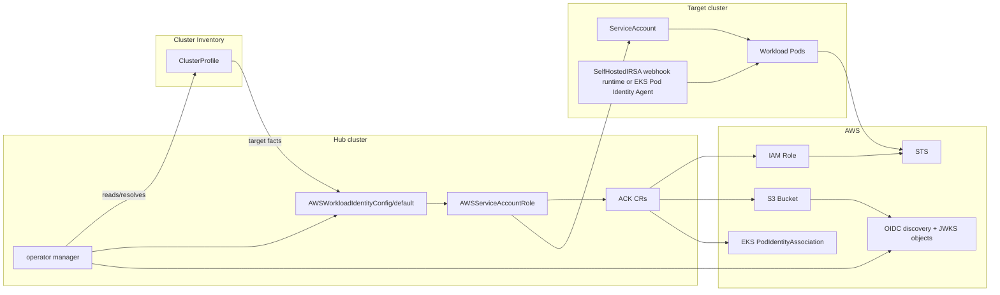

# Architecture

`aws-workload-identity-operator` runs on a hub cluster and manages workload AWS
identity across target clusters.

The namespace containing an `AWSWorkloadIdentityConfig/default` is the
target-cluster boundary. In OCM environments, that namespace normally matches
the `open-cluster-management.io/cluster-name` label value of the target
`ClusterProfile`.

## Control Planes

The operator is the writer for local API object status and for remote delivery
resources. ACK remains responsible for reconciling AWS resources from ACK CRs
and for surfacing AWS-side failures on those CRs.

Cluster Inventory access providers are the source of remote Kubernetes
`rest.Config` values used by multicluster-runtime. Reconcilers do not read
Cluster API `Cluster` objects or remote kubeconfig Secrets directly.

ACK owns the S3 Bucket CR and AWS bucket lifecycle. The operator manager writes
the two public OIDC issuer objects into that bucket with the AWS S3 API.

## Resource Boundaries

- `AWSWorkloadIdentityOperatorConfig/default` is cluster-scoped platform
  configuration.
- `AWSWorkloadIdentityConfig/default` configures one target cluster namespace.
- `AWSServiceAccountRole` binds one remote `ServiceAccount` to AWS permissions.
- `AWSServiceAccountRoleReplicaSet` fans out bindings from an OCM `Placement`.

Detailed ownership rules are in [Resource Ownership](resource-ownership.md).
